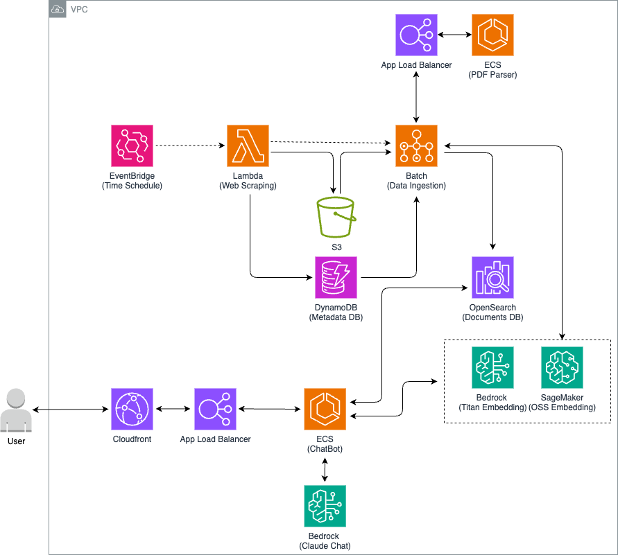

# 💰 Wealth Whisper
- - -
Introducing an AI-powered assistant that provides valuable insights and information for making smart investment decisions in the Korean financial market!
  
This application leverages an AI assistant that searches through financial analyst reports to answer your questions. The chatbot can respond to queries such as "What are the expected earnings for Samsung Electronics?" or "What is the outlook for US interest rates?"

## 🛠 Usage Instructions
- - -
### Step 1: Preliminaries

* **Python Installation**: Ensure Python is installed in your environment.
* **AWS Configuration**: [Set up your AWS credentials and configuration](https://docs.aws.amazon.com/cli/latest/userguide/cli-configure-files.html) prior to deployment. This includes having access to an AWS account and the [AWS CLI](https://aws.amazon.com/cli/) configured on your machine.

### Step 2: Install Required Packages

* **Install the AWS CDK**: `Run npm install -g aws-cdk` to install the [AWS Cloud Development Kit](https://aws.amazon.com/cdk/) globally on your machine.
* **Install Python Dependencies**: Execute `pip install -r requirements.txt` to install necessary Python packages for the app.

### Step 3: Provision Infrastructure

* **Deploy with CDK**: Utilize the CDK to deploy the required AWS services with `cdk deploy --all`.  
* Install the OpenSearch plugin by running `python scripts/install_package.py`.
* Upload the configuration file to S3 using `python scripts/upload_config.py` (modify app/configs/config.yaml if needed). 
️
### Step 4: Access the Application

* Once the CDK deployment is complete, access the [Streamlit](https://streamlit.io/) application via the provided CloudFront DNS name (e.g., https://xyz.cloudfront.net)
* Start asking questions and receiving valuable investment insights
* Note: Analyst reports from the previous day are indexed into OpenSearch on a daily basis, so it may take some time to accumulate the documents

## 👷 Architecture
- - -

### Data Indexing Pipeline
* EventBridge triggers daily indexing job.
* Lambda functions store documents in S3 and save metadata in DynamoDB.
* Batch processes index documents and metadata into OpenSearch.

### Search Engine
* OpenSearch powers the search functionality.
* Semantic vectorization using Bedrock or SageMaker models for enhanced search relevance and accuracy.

### Chatbot Application
* Built using [LangChain](https://www.langchain.com/) and Streamlit frameworks.
* Runs on ECS for scalability and reliability.
* Retrieves relevant documents from OpenSearch based on user queries.
* Utilizes the Claude model from Bedrock to generate responses and engage in conversational interactions.
* Frontend hosted using CloudFront for efficient content delivery.

## 🤝 Contributions
- - -
Contributions are welcome! Feel free to open issues or pull requests to improve the application or documentation.